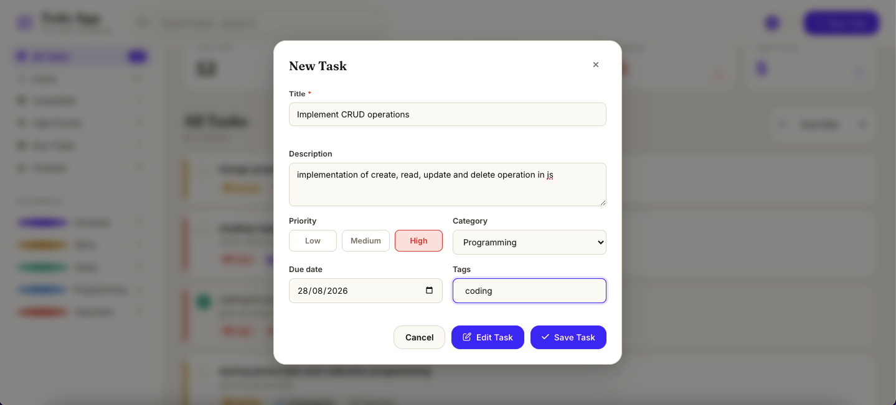
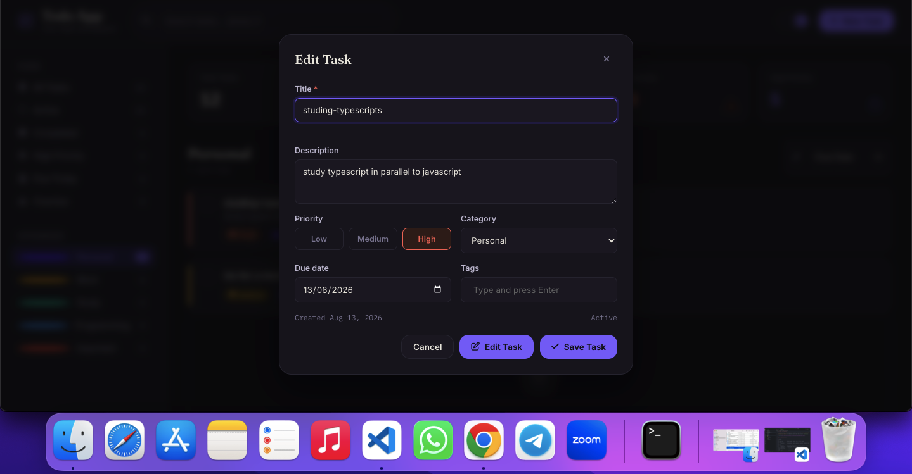
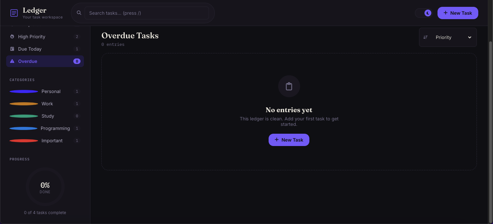
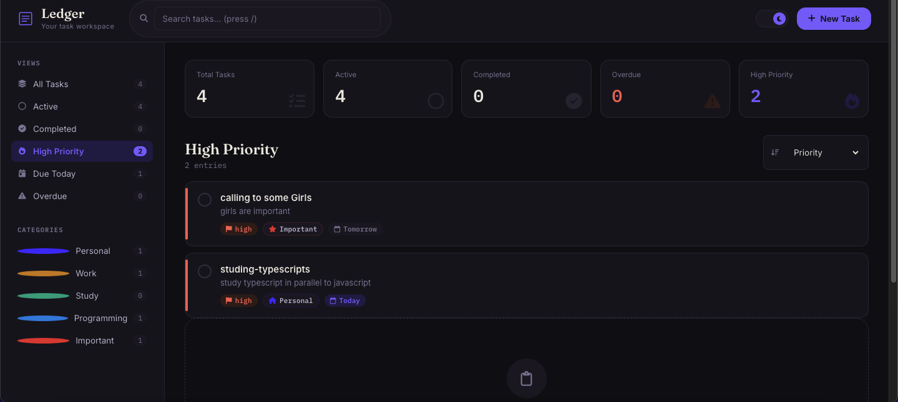

# Todo-App

A production-quality, fully animated task management app built with **vanilla HTML5, CSS3, and JavaScript (ES6+)** — no frameworks, no build step. Tasks persist in `localStorage`.


## 1. Project structure

```text
todo-app/
│
├── index.html          # Markup: header, sidebar, stats, task list, modals
├── css/
│   └── style.css        # Design tokens, layout, components, animations, responsive rules
│
├── js/
│   ├── utils.js         # Pure helper functions (dates, formatting, debounce, counters)
│   ├── storage.js        # localStorage read/write wrapper, isolated by key
│   ├── tasks.js           # Data model: Task shape, categories, TaskManager (CRUD, filter, sort, stats)
│   ├── ui.js               # DOM rendering: task cards, sidebar, modals, toasts, progress ring
│   └── app.js               # Orchestrator: wires events to state, owns the render loop
│
└── README.md
```

Each script is a self-contained module (via an IIFE or a class) and is loaded in dependency order in `index.html`: `utils → storage → tasks → ui → app`.

## 2. How the application works

**State** lives in two places:

- `TaskManager` (in `tasks.js`) owns the actual task data and persists every mutation to `localStorage` immediately.
- A small `state` object inside `app.js` owns _view_ state — the active filter, category, sort order, and search term — and is itself persisted (except search) so your view survives a refresh.

**Render loop:** every user action (add, edit, delete, toggle, filter, sort, search) calls a single `render()` function in `app.js`. It re-derives the visible task list from `TaskManager` + `state`, then hands it to `UI` to redraw the stats, sidebar counts, progress ring, and task cards. There is no partial-update logic to keep in sync — one function, one source of truth.

**Modals** are reused: the same task-form modal handles _create_, _edit_, and _read-only view_ (with an "Edit Task" button to switch into edit mode), driven by a `mode` argument.

## 3. How LocalStorage works

`storage.js` wraps `localStorage` with three keys:

| Key               | Contents                                      |
| ----------------- | --------------------------------------------- |
| `ledger.tasks.v1` | Array of all task objects                     |
| `ledger.theme.v1` | `"light"` or `"dark"`                         |
| `ledger.prefs.v1` | `{ filter, category, sort }` — your last view |

All reads/writes are wrapped in `try/catch` and check for `localStorage` availability first (`Storage.available`), so the app degrades gracefully (in-memory only, no crash) in environments where storage is blocked (e.g. private browsing with strict settings).

## 4. How the modules interact

```
utils.js   →  no dependencies (pure functions)
storage.js →  no dependencies (wraps localStorage)
tasks.js   →  depends on: utils.js, storage.js
ui.js      →  depends on: utils.js, tasks.js (reads CATEGORIES, TaskManager.getCategory)
app.js     →  depends on: all of the above — wires DOM events to TaskManager + UI
```

`ui.js` never imports or mutates task data directly — it only renders what it's given and exposes methods like `openTaskModal()`, `toast()`, `confirmDialog()`. `app.js` is the only file that decides _when_ those happen.

## 5. Running the project

No build tools, no dependencies. Two ways to run it:

**Option A — just open it:**
Double-click `index.html`, or drag it into a browser tab.

**Option B — local server (recommended, avoids any browser file:// quirks):**

```bash
cd todo-app
python3 -m http.server 8080
# then open http://localhost:8080
```

or, with Node installed:

```bash
npx serve .
```

## 6. Important functions

| Function                                                   | File     | Purpose                                              |
| ---------------------------------------------------------- | -------- | ---------------------------------------------------- |
| `TaskManager.createTask(input)`                            | tasks.js | Validates + stores a new task                        |
| `TaskManager.applyFilter(tasks, filter, category, search)` | tasks.js | Pure filtering — returns a new array                 |
| `TaskManager.applySort(tasks, sortBy)`                     | tasks.js | Pure sorting — returns a new array                   |
| `TaskManager.getStats()`                                   | tasks.js | Computes dashboard totals + completion rate          |
| `UI.renderTaskList(tasks, opts)`                           | ui.js    | Redraws the task list + empty state                  |
| `UI.openTaskModal({mode, task})`                           | ui.js    | Opens the create/edit/view modal                     |
| `UI.confirmDialog({title, text})`                          | ui.js    | Returns a Promise\<boolean\> for destructive actions |
| `render()`                                                 | app.js   | The single re-render entry point                     |

## 7. Features implemented

- Full CRUD (create, edit, delete, duplicate, view details)
- Priority (low/medium/high) with color-coded pills and a left-edge priority tab on each card
- Categories (Personal, Work, Study, Programming, Important) with counts in the sidebar
- Due dates with overdue/due-today detection and relative labels ("Today", "Tomorrow", "3d overdue")
- Tags (add via Enter/comma, removable chips)
- Real-time search (title, description, tags) with debounce
- Filters: All / Active / Completed / High Priority / Due Today / Overdue / by Category
- Sorting: Newest, Oldest, Priority, Due Date, Alphabetical
- Animated stats dashboard + circular progress ring
- Light/dark theme with animated toggle, respects system preference on first visit
- Toast notifications (success/error/info) replacing browser alerts
- Custom animated confirm dialog for destructive actions
- Keyboard shortcuts: `/` focus search, `Enter` submit form, `Esc` close modal/dialog/sidebar
- Fully responsive: desktop, tablet, and a dedicated mobile layout (off-canvas sidebar)
- Accessible: semantic HTML, labelled controls, keyboard-operable task cards, visible focus states, `aria-live` regions for the task list and toasts

## 8. Customization

- **Colors / fonts / spacing:** all defined as CSS custom properties at the top of `css/style.css` under `:root` (light) and `[data-theme="dark"]`. Change a value once, it updates everywhere.
- **Categories:** edit the `CATEGORIES` array at the top of `js/tasks.js` — add `{ id, name, color, icon }` (icon is a Font Awesome class).
- **Priority colors:** `--priority-low/medium/high` tokens in `style.css`.
- **Storage keys:** change the versioned keys in `storage.js` (`v1` suffix) if you ever need to migrate the data shape.

## 9. Possible future improvements

- Drag-and-drop manual reordering / kanban-style board view
- Subtasks / checklists within a task
- Recurring tasks
- Export/import (JSON, CSV, or `.ics` for due dates)
- Multi-device sync via a backend (the module boundaries here make swapping `storage.js` for an API client straightforward without touching `ui.js` or `app.js`)
- Undo toast after delete instead of only a confirm dialog
- PWA support (offline caching, installable)
  
  
  
  
  
  Author
  Sisay Negash
